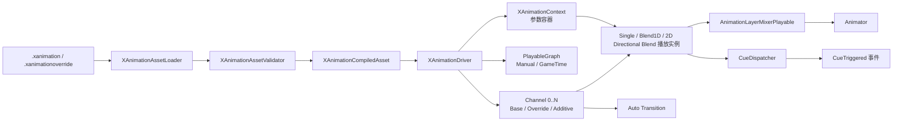
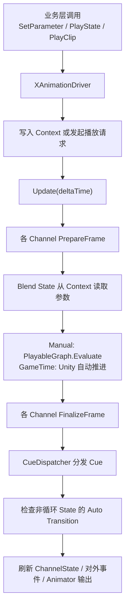

# XFramework XAnimation 播放系统

> `XAnimation` 是基于 Unity Playables 的轻量动画播放系统，核心代码位于 `XAnimation/Runtime/` 与 `XAnimation/Editor/` 下，并已按功能拆分为多个子目录，统一命名空间分别为 `XFramework.Animation` 与 `XAnimationEditor`。它用 `.xanimation` / `.xanimationoverride` 文本配置描述动画通道、状态、动画片段、事件点和换装覆盖关系，运行时由 `XAnimationDriver` 驱动播放，并支持 `Manual` 与 `GameTime` 两种更新模式。系统的基础目标是保留 Unity `Animator` 作为骨骼输出与原生 Root Motion 容器，只替换 `Animator Controller` 的运行时动画层。

---

## 1. 概述

- 核心源码目录：[`Runtime/`](../Runtime/) 与 [`Editor/`](../Editor/)
- 当前目录分层：
  - `Runtime/Core|Asset|Playback|Cue|Debug`
  - `Editor/Asset|Inspector|Preview|Preview/UI|Debug|Playback`
- README 入口：[`README.md`](../../README.md)
- 适合希望通过代码显式控制动画状态、混合层和事件点，而不是为简单角色维护复杂 Animator Controller 的场景。
- `XAnimation` 的设计初衷就是不引入 Animator Controller 风格的状态机；业务状态切换由代码显式维护，资源层只提供播放描述和轻量自动流转能力。
- `XAnimation` 当前定位是“替换 `Animator Controller` 的运行时动画层”，而不是“移除 `Animator` 组件本身”。`Animator` 仍负责 Playables 输出落地、骨骼求值以及原生 Root Motion 回调链路。

### 1.1 适用场景

- 需要用代码显式播放动画状态，不想为简单角色维护复杂 Animator Controller。
- 需要 Base / Override / Additive 多通道混合，并可选 `AvatarMask`。
- 需要 1D Blend，例如 `idle / walk / run` 随速度参数连续混合。
- 需要 2D Directional Blend，例如 8 向移动、8 向持枪平移、带 `idle` 中心点的方向过渡。
- 需要按动画归一化时间触发脚步、攻击判定、音效等 `Cue` 事件。
- 需要通过 Override Asset 复用同一套动作 key，只替换部分角色动画资源。

### 1.2 架构总览

下面这张图可以直接把 `XAnimation` 的核心分层和数据流看清楚：



可以把它理解成 4 层：

- 资源层：`.xanimation` / `.xanimationoverride` 只描述通道、片段、状态、参数、Cue 和自动切换规则。
- 编译层：`XAnimationAssetLoader` 负责加载、合并 Override、校验配置，并生成 `XAnimationCompiledAsset`。
- 驱动层：`XAnimationDriver` 负责对外暴露播放与参数接口，并直接维护 `XAnimationContext`、Unity `PlayableGraph`、多个 `Channel`、Cue 分发和全局 Root Motion 开关。
- 播放层：每个 `XAnimationChannel` 负责同一通道内 current / previous state 的淡入淡出，具体 state playback 负责 Single / Blend 的采样与权重。

### 1.3 一帧是怎么跑的



几个关键点：

- `XAnimation` 的“图”只有 Unity `PlayableGraph`，它是播放图，不是状态机图。
- `XAnimation` 的核心思路是“状态决策交给代码，动画播放交给资源描述”。
- 状态切换入口只有两类：业务层显式 `PlayState / PlayClip`，或非循环 state 命中 `autoTransitions` 后自动回落/衔接。
- `Blend1D` / 2D Directional Blend 不自己决定切换到哪个 state，它们只负责当前 state 内部的样本混合。
- `Cue` 和 Root Motion 都是在播放层按当前实际输出结果计算，而不是靠 Animator Controller 状态机回调；Unity 原生 `AnimationEvent` 默认通过 `Animator.fireEvents = false` 关闭，避免目标对象缺少接收函数时报错。

---

## 2. 资源创建与预览

- 菜单 **`XFramework/Tools/XAnimation Preview`** 可打开预览与编辑窗口。
- `XAnimation / Override Asset` 支持加载普通 XAnimation Asset 或 Override Asset。
- 普通资源可编辑 `Channels`、`States`、`Clips`、`Parameters`、`Cues`，并可预览 state 播放；Override 资源只覆盖已有 clip 的 `clipPath`，不会修改 base 资源结构。
- 预览窗口顶部工具栏的 `Setting` 页用于配置预览 prefab、XAnimation 资源和 `Preload`。`Preload` 写入普通 `.xanimation`；`.xanimationoverride` 会继承 base 资源的设置。
- 预览窗口会在当前 tab 真正可见时才推进动画和执行渲染；如果窗口被其他 tab 或其他编辑器界面覆盖，会自动暂停后台预览，避免持续占用编辑器 CPU / GPU。
- 预览窗口始终使用 `Manual` 更新模式，以保证暂停、单帧步进、Seek、Cue Log 和调试图显示都可控且可复现；运行时 `XAnimationActor.UpdateMode` 不会影响预览。
- 预览暂停遵循当前播放目标的 channel 类型：目标是 `Base` 时暂停整个预览；目标是非 `Base` channel 时只冻结该 channel，Base 和其他 channel 继续播放。
- 预览窗口的相机渲染默认走稳定优先配置：关闭 HDR 与 MSAA，以降低 Unity 6000 + D3D12 下的预览渲染压力。
- 预览窗口使用 `PreviewRenderUtility` 离屏实例渲染 prefab。若同一模型挂 `XAnimationActor` 后在场景 Inspector 预览正常，但在 `XAnimation Preview` 中出现头部正常、身体蒙皮异常等问题，优先检查离屏预览下 `SkinnedMeshRenderer` 的刷新条件；Preview 实例会强制开启 `updateWhenOffscreen` 和 `forceMatrixRecalculationPerRender`，避免 EditMode 离屏渲染时蒙皮矩阵或 Bounds 未稳定刷新。
- 调试 UI 采用“局部连续刷新 + 事件驱动刷新”：
  - `Channel` 调试区中的 `normalizedTime / totalNormalizedTime / weight / speed / nextStateKey / Blend` 等连续数值，会在预览可见且动画实际推进时同步更新。
  - `State / Clip` 高亮、暂停 / 停止按钮状态、`Cue Log` 列表等非连续区域，只会在播放状态变化、Cue 追加或用户操作时刷新。
- 切回 `XAnimation Preview` 时，窗口会立即同步当前预览状态，不会在后台偷偷累计时间后一次性快进。
- 示例资源可参考 `Assets/Animation/XAnimationSamples/XAnimationPreview_WolfLite.xanimation` 与 `XAnimationOverride_WolfLite.xanimationoverride`。

### 2.1 Editor 代码注意事项

- `XFramework` 内已经存在命名空间 `XFramework.Event`。
- 在 Editor 窗口、Inspector、`OnGUI` 或 IMGUI 代码里，如果需要访问 Unity 的 `Event.current`，不要直接写 `Event.current`。
- 推荐统一写法：

```csharp
using UEvent = UnityEngine.Event;
```

然后使用：

```csharp
if (UEvent.current.type == EventType.Repaint)
{
    // ...
}
```

- 这样可以避免 `Event` 被解析到 `XFramework.Event`，出现 `Event.current` 不存在或 `Event` 被当成命名空间的编译错误。

---

## 3. 配置结构

普通 XAnimation Asset 的核心字段如下：

```json
{
  "alias": "hero",
  "channels": [
    {
      "name": "base",
      "layerType": "Base",
      "defaultWeight": 1.0,
      "maskPath": "",
      "allowInterrupt": true,
      "defaultFadeIn": 0.15,
      "defaultFadeOut": 0.15
    }
  ],
  "clips": [
    {
      "key": "idle",
      "clipPath": "Assets/Art/Hero/Hero.fbx|Idle"
    }
  ],
  "states": [
    {
      "key": "idle",
      "stateType": "Single",
      "clipKey": "idle",
      "channelName": "base",
      "allowedNextStateKeys": [],
      "allowedPreviousStateKeys": [],
      "speed": 1.0,
      "loop": true
    },
    {
      "key": "locomotion",
      "stateType": "Blend1D",
      "channelName": "base",
      "parameterName": "moveSpeed",
      "allowedNextStateKeys": [],
      "allowedPreviousStateKeys": [],
      "speed": 1.0,
      "loop": true,
      "samples": [
        { "clipKey": "idle", "threshold": 0.0 },
        { "clipKey": "walk", "threshold": 1.0 },
        { "clipKey": "run", "threshold": 3.0 }
      ]
    },
    {
      "key": "locomotion8dir",
      "stateType": "Blend2DSimpleDirectional",
      "channelName": "base",
      "parameterXName": "moveX",
      "parameterYName": "moveY",
      "allowedNextStateKeys": [],
      "allowedPreviousStateKeys": [],
      "speed": 1.0,
      "loop": true,
      "directionalSamples": [
        { "clipKey": "idle", "positionX": 0.0, "positionY": 0.0 },
        { "clipKey": "move_n", "positionX": 0.0, "positionY": 1.0 },
        { "clipKey": "move_ne", "positionX": 0.707, "positionY": 0.707 },
        { "clipKey": "move_e", "positionX": 1.0, "positionY": 0.0 },
        { "clipKey": "move_se", "positionX": 0.707, "positionY": -0.707 },
        { "clipKey": "move_s", "positionX": 0.0, "positionY": -1.0 },
        { "clipKey": "move_sw", "positionX": -0.707, "positionY": -0.707 },
        { "clipKey": "move_w", "positionX": -1.0, "positionY": 0.0 },
        { "clipKey": "move_nw", "positionX": -0.707, "positionY": 0.707 }
      ]
    },
    {
      "key": "locomotionFreeform",
      "stateType": "Blend2DFreeformDirectional",
      "channelName": "base",
      "parameterXName": "moveX",
      "parameterYName": "moveY",
      "allowedNextStateKeys": [],
      "allowedPreviousStateKeys": [],
      "speed": 1.0,
      "loop": true,
      "directionalSamples": [
        { "clipKey": "idle", "positionX": 0.0, "positionY": 0.0 },
        { "clipKey": "walk_n", "positionX": 0.0, "positionY": 1.0 },
        { "clipKey": "run_n", "positionX": 0.0, "positionY": 2.0 },
        { "clipKey": "walk_e", "positionX": 1.0, "positionY": 0.0 }
      ]
    }
  ],
  "autoTransitions": [
    {
      "preStateKey": "attack",
      "nextStateKey": "idle",
      "ExitTime": 0.9,
      "TransitionDuration": 0.1,
      "EnterTime": 0.0
    }
  ],
  "parameters": [
    {
      "name": "moveSpeed",
      "type": "Float",
      "defaultValue": 0.0
    },
    {
      "name": "moveX",
      "type": "Float",
      "defaultValue": 0.0
    },
    {
      "name": "moveY",
      "type": "Float",
      "defaultValue": 0.0
    }
  ],
  "cues": [
    {
      "clipKey": "idle",
      "time": 0.5,
      "eventKey": "footstep",
      "payload": "L"
    }
  ]
}
```

字段说明：

- `channels`：动画混合通道。`layerType` 支持 `Base`、`Override`、`Additive`；`maskPath` 可绑定 `AvatarMask`；`defaultFadeIn / defaultFadeOut` 是该通道的默认过渡时长。
- `clips`：动画片段索引，是 state 引用的叶子资源，只描述 `key` 与 `clipPath`。`clipPath` 支持普通资源路径，也支持 `FBX路径|子动画名`。
- `states`：业务播放单位。`Single` 引用一个 `clipKey`；`Blend1D` 绑定一个 Float 参数和若干采样点，运行时只混合相邻两个采样 clip；`Blend2DSimpleDirectional` / `Blend2DFreeformDirectional` 绑定两个 Float 参数和一组二维采样点，前者按方向相似度混合邻近方向，后者支持同方向不同半径样本，例如 walk/run forward；channel、loop、speed 等播放语义都属于 state。`allowedNextStateKeys` / `allowedPreviousStateKeys` 是可选的双向门禁：空数组或不填都表示不限制。
- `autoTransitions`：状态自动切换配置。用于声明某个非循环 state 在播放到指定进度后，自动切到下一个 state，并可指定切换时长与目标状态起播时间。
- `parameters`：状态运行时参数，支持 `Float`、`Int`、`Bool`、`Trigger`。`Blend1D` 每帧从 `XAnimationContext` 读取一个 Float 参数；2D Directional Blend 每帧读取 `parameterXName + parameterYName` 两个 Float 参数。
- `cues`：动画事件点。`time` 是 `[0, 1]` 归一化时间；循环动画每轮都会按 `loopCount` 分发一次。

Override Asset 用于复用 base 配置，只替换指定 clip：

```json
{
  "baseAssetPath": "Assets/Animation/Hero/Hero.xanimation",
  "clips": [
    {
      "key": "run",
      "clipPath": "Assets/Animation/HeroSkin/HeroSkin_Run.anim"
    }
  ]
}
```

### 3.1 Blend1D 与 2D Directional Blend 的区别

- `Blend1D` 适合单轴连续量，例如速度、蓄力值、命中强度。
- `Blend2DSimpleDirectional` 适合方向空间，例如 8 向移动、8 向瞄准、带 idle 中心点的平面输入；同一方向只建议配置一个样本。
- `Blend2DFreeformDirectional` 适合“方向 + 半径”空间，例如同方向的 walk/run forward；它要求恰好一个 `(0,0)` idle 样本，并允许同方向多个非零样本。
- `Blend1D` 使用 `parameterName + samples`。
- `Blend2DSimpleDirectional` / `Blend2DFreeformDirectional` 都使用 `parameterXName + parameterYName + directionalSamples`。
- `Blend2DSimpleDirectional` 第一版不强制必须凑满 8 向，但推荐按 `Idle + N/NE/E/SE/S/SW/W/NW` 作者化，便于移动状态统一复用。

### 3.2 8 向移动推荐坐标

| 语义 | 坐标 |
| --- | --- |
| `Idle` | `(0, 0)` |
| `N` | `(0, 1)` |
| `NE` | `(0.707, 0.707)` |
| `E` | `(1, 0)` |
| `SE` | `(0.707, -0.707)` |
| `S` | `(0, -1)` |
| `SW` | `(-0.707, -0.707)` |
| `W` | `(-1, 0)` |
| `NW` | `(-0.707, 0.707)` |

### 3.3 Auto Transition 配置

`autoTransitions` 用于描述“某个状态播放到一定进度后，自动切换到另一个状态”的轻量规则。它不是状态机条件系统，而是给那些业务上已经确定流向、只是不想每次都手写收尾切换的场景用的，例如 `jumpStart -> jumpLoop`、`attack -> idle`、`hit -> recover`、`open -> idle`。

```json
{
  "autoTransitions": [
    {
      "preStateKey": "attack",
      "nextStateKey": "idle",
      "ExitTime": 0.9,
      "TransitionDuration": 0.1,
      "EnterTime": 0.0
    }
  ]
}
```

- `preStateKey`：当前播放完后要离开的状态 key。
- `nextStateKey`：自动切换到的目标状态 key；为空时表示当前状态播完后直接停止。
- `ExitTime`：当前状态播放到哪个 normalized time 时触发自动切换，范围 `[0, 1]`。
- `TransitionDuration`：自动切换过渡时长；当值 `<= 0` 时，会回退到 channel 的 `defaultFadeIn / defaultFadeOut`。
- `EnterTime`：目标状态从哪个 normalized time 开始播放，范围 `[0, 1]`。
- `autoTransitions` 也受 state 门禁限制；如果 `preState -> nextState` 不满足来源 state 的 `allowedNextStateKeys` 或目标 state 的 `allowedPreviousStateKeys`，这次自动切换会被拒绝。

编辑器中的 `XAnimation Preview` 已提供对应的 Auto Transition 编辑区，可直接配置 `preState`、`nextState`、`ExitTime`、`TransitionDuration` 与 `EnterTime`，并通过时间轴可视化观察切换时机。

适合交给 `autoTransitions` 的情况：

- 某个非循环动作播到特定进度后，后续去向是固定的。
- 这个流转不依赖复杂条件判断，只依赖“播到了哪里”。
- 你希望资源层顺手描述这一跳，减少业务代码里重复写“播完接下一个 state”。

不适合交给 `autoTransitions` 的情况：

- 下一状态取决于输入、移动方向、战斗判定、技能阶段或其他运行时业务条件。
- 同一个状态可能根据上下文跳向多个不同目标。
- 你需要完整状态机、条件图或 Any State 一类的行为。

这些情况应该继续由业务代码自行决定，并在合适时机显式调用 `PlayState`。

---

## 4. 运行时使用方式

业务侧通常持有一个 `XAnimationDriver`，在对象初始化时绑定资源和 `Animator`，在每帧 `Update` 中手动推进。

```csharp
using UnityEngine;
using XFramework.Animation;

public sealed class HeroAnimationController : MonoBehaviour
{
    [SerializeField] private Animator m_Animator;
    [SerializeField] private string m_AnimationAssetPath = "Assets/Animation/Hero/Hero.xanimation";

    private readonly XAnimationDriver m_Driver = new XAnimationDriver();

    private void Awake()
    {
        m_Driver.Initialize(m_AnimationAssetPath, m_Animator);
        m_Driver.CueTriggered += OnCueTriggered;
        m_Driver.PlayState("idle");
    }

    private void Update()
    {
        m_Driver.Update(Time.deltaTime);
    }

    public void PlayRun()
    {
        m_Driver.SetParameter("moveSpeed", 3f);
        m_Driver.PlayState("locomotion");
    }

    public void PlayAttack()
    {
        m_Driver.PlayState("attack", new XAnimationTransitionOptions
        {
            fadeIn = 0.08f,
            fadeOut = 0.12f,
            priority = 10,
            interruptible = true,
        });
        m_Driver.SetGlobalSpeed(1f);
    }

    private void OnCueTriggered(XAnimationCueEvent cueEvent)
    {
        if (cueEvent.eventKey == "footstep")
        {
            Debug.Log($"Footstep: {cueEvent.payload}");
        }
    }

    private void OnDestroy()
    {
        m_Driver.CueTriggered -= OnCueTriggered;
        m_Driver.Dispose();
    }
}
```

常用控制接口：

- `PlayState(string stateKey, XAnimationTransitionOptions transition = default)`：按 state key 播放，始终使用 state 自己配置的 channel，推荐业务层统一使用；`transition` 中的 `fadeIn` / `fadeOut` / `enterTime` 描述本次过渡时序，`priority` / `interruptible` 是本次播放请求携带的打断仲裁参数，播放成功后会成为新 current playback 的运行时属性。
- `PlayState(string stateKey, bool force)` / `PlayState(string stateKey, XAnimationTransitionOptions transition, bool force)`：`XAnimationActor` / `XAnimationDriver` 提供的强制切换重载；`force = true` 时会忽略门禁、`allowInterrupt`、`interruptible` 与 `priority`。
- `PlayAction(string stateKey, XAnimationActionOptions options = default)`：播放一个带生命周期的 gameplay action。底层仍是 `PlayState`，但会记录同 channel 的 previous state，支持按 `cancelableAfter` 取消，并在完成或取消后按 `returnMode` 回到 previous / 指定 state / 不返回。
- `PlayClip(string clipKey, string channelName, XAnimationTransitionOptions transition = default)`：底层/调试接口，按配置中的 clip key 直接播放；必须显式提供 `channelName`。
- `PlayClip(AnimationClip clip, string channelName, XAnimationTransitionOptions transition = default)`：直接播放外部传入的 `AnimationClip` 引用，不要求写入 `.xanimation` 配置；它会创建临时 state，使用目标 channel 的默认淡入淡出，不触发 `.xanimation` cue。Clip 自带的 Unity `AnimationEvent` 是否触发由 `UnityAnimationEventsEnabled` 决定，默认不触发。
- `PreloadState(string stateKey)`：同步预加载指定 state 会用到的 clip，`Single` 加载单个 clip，Blend state 会加载全部采样 clip，适合在角色入场或技能释放前主动预热。
- `PreloadAll()`：同步预加载当前 XAnimation 资源内的全部 clip，适合小型资源或确定要完整常驻的一组动作。
- `SetParameter(key, float/int/bool)` / `SetTrigger(key)`：写入运行时参数，`Blend1D` 默认从 Float 参数读取混合值，2D Directional Blend 默认从两个 Float 参数读取二维输入。
- `Stop(channelName, fadeOut)` / `StopAll(fadeOut)`：停止指定通道或全部通道。
- `Pause()` / `Resume()`：暂停或恢复整个 `XAnimationDriver`；`Manual` 下暂停会阻止运行时继续推进，`GameTime` 下暂停会停止 `PlayableGraph`，不适合作为精确停帧采样手段。
- `PauseChannel(channelName)` / `ResumeChannel(channelName)` / `SetChannelPaused(channelName, paused)`：只暂停或恢复指定 channel。暂停期间该 channel 的播放时间、淡入淡出、Cue、自动转场和 `StateBehavior.Update` 都会冻结，其他 channel 继续推进；`IsChannelPaused(channelName)` 可查询当前状态。
- `SeekChannel(channelName, normalizedTime)`：把指定 channel 的当前播放定位到归一化时间 `0~1`；传入前需要把帧号换算成归一化时间。
- `SyncFrame()`：仅 `Manual` 模式可用，用 `deltaTime = 0` 立即评估一帧，常用于 `SeekChannel` 后把 `Animator` 立刻采样到目标姿态。
- `SetChannelWeight(channelName, weight)` / `GetChannelWeight(channelName)`：调整或查询通道当前的运行时混合权重。
- `SetGlobalSpeed(speed)`：调整全局播放速度倍率，最小值会被限制为 0；最终速度等于 `state.speed * globalSpeed`。
- `SetUpdateMode(updateMode)`：切换运行时更新模式。默认 `Manual`；`GameTime` 会让 `PlayableGraph` 交给 Unity 自动推进，用于性能优先场景。
- `SetUnityAnimationEventsEnabled(enabled)`：控制 Unity 原生 `AnimationEvent` 是否通过 `Animator.fireEvents` 触发，默认关闭；关闭后仍可从 `AnimationClip.events` 派生 XAnimation Cue。
- `SetRootMotionEnabled(enabled)`：全局启停 Root Motion 输出；运行时和 `XAnimation Preview` 都直接切换 Unity 原生 `Animator.applyRootMotion`。
- `GetChannelState(channelName)`：查询当前播放 clip、归一化时间、权重、速度、优先级，以及当前是否处于 transition、previous state、transition 来源、最近一次拒绝原因等调试信息。
- `IsPlaying(stateKey, channelName)`：查询当前叶 State 所在子树；当前播放节点本身及其全部 Normal / Selector 父节点都会返回 `true`。`GetChannelState().stateKey` 是实际播放的叶 State，`requestedStateKey` 保留业务调用 `PlayState` 时传入的 key。

Selector 子树内直接 `PlayState(子节点)`，或 `autoTransitions.nextStateKey` 指向其子节点时，运行时会从该子树最外层的 Selector 按当前 Int 参数解析实际要播放的叶 State。后续修改该 Selector 链上的参数会继续按 Selector 重选并切换 State；参数值超出子节点范围时，显式播放会失败，已由 Selector 控制的 channel 在参数变更时会停止。

### 4.1 Action Playback

`PlayAction` 是对现有 `PlayState` 的 gameplay 封装，不是新状态机。它适合攻击、受击、技能、交互等 one-shot 动作：动作启动前会记录当前 channel 的非临时 state，动作完成或主动取消后，可按规则回到原 state 或指定 state。

```csharp
XAnimationActionHandle handle = actor.PlayAction("attack_01", new XAnimationActionOptions
{
    transition = new XAnimationTransitionOptions
    {
        fadeIn = 0.05f,
        fadeOut = 0.1f,
        priority = 10,
        interruptible = false
    },
    cancelableAfter = 0.35f,
    returnMode = XAnimationActionReturnMode.PreviousState
});

handle.OnExit(result =>
{
    Debug.Log($"Action {result.StateKey} => {result.Status}, return = {result.ReturnStarted}");
});
```

`default(XAnimationActionOptions)` 表示使用普通 transition 解析、非强制播放、可立即取消、取消时使用 channel 默认 fadeOut、完成后回到 previous state。`returnMode = State` 时需要填写 `returnStateKey`；`returnMode = None` 时动作结束后不主动返回。

几个边界：

- Action 只接受已有 state key；第一版不支持直接播放 clip。
- Action 应优先用于非循环 state；循环 state 需要业务调用 `Cancel()`、`Stop()` 或由其他更高优先级播放请求打断。
- 循环 state 不会自然触发 `Completed`，因此默认的 `returnMode = PreviousState` 也不会自动执行；这种 action 更适合表示持续施法、蓄力、举盾、持续交互等“进入后由业务决定何时退出”的动作。
- 即使是循环 state，`XAnimationActionHandle.OnExit(...)` 仍然可以监听它最终是被 `Canceled`、`Interrupted`、`Stopped` 还是 `Disposed` 退出。
- Action 被其他播放请求打断时状态为 `Interrupted`，不会自动返回，避免旧 action 抢回动画控制权。
- Action state 自己触发 `autoTransitions` 时，第一版按被后续播放打断处理，不再额外执行 action return。
- 编辑器预览窗口的 `Playback` HUD 中提供 `Action Debug` 折叠区，可选择 state、return mode、cancel 参数并观察当前 action handle 状态。

### 4.2 更省事的组件封装：XAnimationActor

如果业务不想自己维护 `XAnimationDriver` 生命周期，可以直接挂 `XAnimationActor`：

- `XAnimationActor` 会在 `Awake` 中帮你处理初始化和可选的起始 state，并通过 `UpdateMode` 选择 `Manual` 或 `GameTime` 更新；如果业务订阅 `NativeRootMotionApplied`，Actor 会按需挂桥接组件接收 Unity 原生 `OnAnimatorMove()`。
- 它本质上只是 `XAnimationDriver` 的 `MonoBehaviour` 包装层，不会引入额外状态机语义。
- 适合做角色预制体上的直接挂载；如果你需要更细粒度的接管，仍建议直接持有 `XAnimationDriver`。
- 如果业务需要自己消费原生 Root Motion，可订阅 `XAnimationActor.NativeRootMotionApplied`，在回调中自行把 `Animator.deltaPosition / deltaRotation` 应用到 `CharacterController`、`NavMeshAgent` 或其他运动系统。
- 运行时代码设置 `Animator`、`UpdateMode`、`UnityAnimationEventsEnabled`、`AnimationAsset` 时，Actor 会按当前字段是否齐全自动判断能否初始化。
- 初始化成功后再修改 `Animator`、`UpdateMode`、`UnityAnimationEventsEnabled` 会抛出 `XAnimationException`。如果运行时需要指定这些初始化参数，应先设置它们，再设置 `AnimationAsset`。
- `AnimationAsset` 可以随时设置；如果 Actor 已初始化，赋新值会释放旧 Runtime 并用新资源重新初始化。热切资源会停止旧播放，不会自动续播同名 state，也不会自动播放 `Start State Key`。

运行关系可以简单理解为：

```text
MonoBehaviour(Update)
  -> XAnimationActor
    -> XAnimationDriver
      -> PlayableGraph / Animator
```

### 4.3 更新模式

- `Manual` 是默认模式，兼容旧行为。XAnimation 每帧推进自身逻辑并调用 `PlayableGraph.Evaluate(deltaTime)`，支持 Cue、`Step(deltaTime)`、`SyncFrame()`、Seek 与预览调试。
- `GameTime` 是性能优先模式。XAnimation 每帧仍同步状态、淡入淡出、Blend 参数、通道权重和自动转场，但不手动调用 `PlayableGraph.Evaluate(deltaTime)`，图由 Unity 按 `DirectorUpdateMode.GameTime` 推进。
- XAnimation Cue 在 `Manual` 与 `GameTime` 下都由内部 `PlayableBehaviour` 跟随 `PlayableGraph` 采集；`SupportsCue` 为 `true`。`Step(deltaTime)` 与 `SyncFrame()` 仍只支持 `Manual`，非 Manual 调用会抛出异常。
- `XAnimation Preview` 永远固定 `Manual`，不会跟随运行时 Actor 的 `UpdateMode`。

### 4.4 特定帧暂停

特定帧暂停的核心是先把帧号换算成归一化时间：

```csharp
float normalizedTime = Mathf.Clamp01(targetFrame / (clip.length * clip.frameRate));
```

如果运行时使用 `Manual` 模式，可以直接 `Pause + SeekChannel + SyncFrame`。`SeekChannel` 会把当前播放的 `Playable` 时间写到目标位置，`SyncFrame()` 会用 `deltaTime = 0` 立即评估一帧，让 `Animator` 立刻采样到目标姿态。

```csharp
driver.SetUpdateMode(XAnimationUpdateMode.Manual);
driver.Pause();
driver.SeekChannel("Base", normalizedTime);
driver.SyncFrame();
```

如果要在播放 state 的同时从指定帧进入，也可以把归一化时间写入 `enterTime`：

```csharp
driver.SetUpdateMode(XAnimationUpdateMode.Manual);
driver.PlayState("attack", new XAnimationTransitionOptions
{
    enterTime = normalizedTime,
    fadeIn = 0f
});
driver.Pause();
driver.SyncFrame();
```

如果运行时使用 `GameTime` 模式，不建议用 `Pause()` 做单层停帧。`GameTime` 下 `Pause()` 会停止整个 graph；需要保持 Base 继续播放时，应改用 `PauseChannel()` 冻结目标 channel。

```csharp
driver.SetUpdateMode(XAnimationUpdateMode.GameTime);
driver.PlayState("attack", new XAnimationTransitionOptions
{
    enterTime = normalizedTime,
    fadeIn = 0f
});
driver.PauseChannel("UpperBody");
```

恢复该层播放时：

```csharp
driver.ResumeChannel("UpperBody");
```

注意：`XAnimationActor` 目前只封装了部分 `XAnimationDriver` 接口。通过 Actor 做 `GameTime` 首帧进入并冻结时，可以使用 `UpdateMode`、`PlayState(... enterTime ...)` 和 `GlobalSpeed = 0f`；如果业务需要直接调用 `SeekChannel()` 或 `SyncFrame()`，应持有 `XAnimationDriver`，或按项目需要在 Actor 上补转发方法。

### 4.5 Unity AnimationEvent

- XAnimation 默认关闭 Unity 原生 `AnimationEvent`，内部通过 `Animator.fireEvents = false` 实现，不修改也不复制原始 `AnimationClip`。
- 关闭 Unity 原生 `AnimationEvent` 只影响 Unity 对目标 GameObject 的函数回调，不影响 XAnimation 从 `AnimationClip.events` 读取数据并派生 Cue。
- 如果业务需要保留 Unity 原生 `AnimationEvent`，可以在 `XAnimationActor` 初始化前设置 `UnityAnimationEventsEnabled = true`，或调用 `XAnimationDriver.SetUnityAnimationEventsEnabled(true)`。此时若目标对象没有对应函数，Unity 仍会按原生规则报错。
- `XAnimation Preview` 始终关闭 Unity 原生 `AnimationEvent`，预览事件观察以 Cue Log 为准。

---

## 5. 规则与注意事项

### 5.1 打断与 Root Motion 规则

- 同一 channel 内播放新 state 时，会把当前 state 作为 previous 输入淡出，新 state 作为 current 输入淡入。
- `Blend1D` / 2D Directional Blend 的子 clip 混合只负责状态内部权重，不负责跨状态自动过渡。
- 同一 channel 内的新播放请求统一按以下顺序仲裁：当前无播放则直接成功；否则先检查 `channel.allowInterrupt`，再检查当前播放的 `interruptible`，最后检查 `request.priority >= 当前播放 priority`。
- 如果当前播放和目标播放都是真实 state，还会额外检查双向门禁：
  - 当前 state 的 `allowedNextStateKeys` 非空时，目标 state 必须在其中。
  - 目标 state 的 `allowedPreviousStateKeys` 非空时，当前 state 必须在其中。
  - 两边都配置时，两边都要满足。
- `priority` / `interruptible` 虽然写在 `XAnimationTransitionOptions` 里，但它们不是过渡匹配优先级，也不影响混合权重；它们是播放请求携带的打断仲裁参数，播放成功后会落到新 current playback 上。
- 对本次仲裁来说，`request.priority` 用来和当前播放的 `priority` 比较；新请求只有在 `priority >= 当前播放 priority` 时才能打断。
- 对本次仲裁来说，`request.interruptible` 不决定它能不能打断当前播放；只有当前播放自己的 `interruptible` 会被检查。请求播放成功后，这个值才会决定新 current playback 之后是否允许被普通请求打断。
- 被挡住的新请求会立即失败，不会排队，也不会挂起等待下一帧自动执行。
- `defaultTransitions` 与 `autoTransitions` 生成的请求，和业务层显式 `PlayState / PlayClip` 一样，都会走同一套仲裁规则。
- `PlayClip` 本身不读取 state 门禁，但它创建出来的临时 state 一旦成为当前播放，后续再切到别的真实 state 时，会像普通 state 一样参与 `allowedNextStateKeys / allowedPreviousStateKeys` 判定。
- `force=true` 的显式 `PlayState` 会跳过门禁、`channel.allowInterrupt`、当前 `interruptible` 与 `priority` 检查，直接强制切换到目标 state。
- 过渡开始时，旧状态会立刻触发 `StateExited`，新状态会立刻触发 `StateEntered`；`GetChannelState()`、`IsPlaying()` 与 `TryGetCurrentState()` 都只把新状态视为 current。
- 过渡重叠期内，旧状态只保留姿态淡出身份，不再保有 current state 语义；但 `Cue` / `AnimationEvent` 允许旧状态与新状态同时按各自权重继续触发。
- `Stop()` / `Dispose()` / 显式终止仍会抑制旧状态后续 `Cue` / `AnimationEvent`，不会沿用“过渡双发”语义。
- Root Motion 只遵循资源级 `rootMotion` 总开关，运行时和预览窗口都通过它切换 Unity 原生 `Animator.applyRootMotion`。

### 5.2 Auto Transition 自动切换规则

- `autoTransitions` 只对非循环 state 生效；循环 state 不能配置自动切换。
- 每个 `preStateKey` 只能配置一条 auto transition，不能重复。
- `preStateKey` 和 `nextStateKey` 都必须指向已存在的 state，且不能自跳转到自己。
- 当前 state 的总归一化时间达到 `ExitTime` 后，运行时会自动发起一次 `Play`：
  - 目标 state 为 `nextStateKey`
  - `enterTime` 直接写入过渡参数
  - `priority` 继承当前播放状态
  - `interruptible` 强制为 `true`
- 当 `TransitionDuration > 0` 时，自动切换会统一使用该值作为 `fadeIn / fadeOut`。
- 当 `TransitionDuration <= 0` 时，自动切换会回退到 channel 的 `defaultFadeIn / defaultFadeOut`。
- 自动切换会和普通 `PlayState` 一样参与同一套仲裁；不会因为是 auto transition 就强制成功。
- 自动切换同样受 `allowedNextStateKeys / allowedPreviousStateKeys` 约束，不会绕过 state 门禁。
- 如果 auto transition 因仲裁失败而没有切出去，当前状态会继续保持播放，不会立即被 `Stop`；后续只要播放实例还在，就允许再次尝试自动切换。
- 如果配置了 auto transition 但 `nextStateKey` 为空，当前状态播到退出点后会直接停止，而不是切到别的状态。

### 5.3 Default Transition 默认过渡规则

- `defaultTransitions` 只支持显式的 `preStateKey -> nextStateKey` 配对，不支持通配、Any State、from-any / to-any 一类规则。
- 当业务层调用 `PlayState(next)`，且当前 state 为 `pre`，如果本次调用没有显式传入 `XAnimationTransitionOptions`，运行时会查 `defaultTransitions` 并使用匹配到的那条过渡参数。
- 一旦本次调用显式传入了 `XAnimationTransitionOptions`，调用方参数优先；运行时不会再把 `defaultTransitions` 的字段叠加到这次请求上。
- `defaultTransitions` 只决定“这一次从 pre 到 next 怎么切”，不会改写目标 state 自身的常规 `speed / loop` 配置。
- 即便命中了 `defaultTransitions`，`pre -> next` 仍然要满足 `allowedNextStateKeys / allowedPreviousStateKeys`；只有显式 `force=true` 的 `PlayState` 才会忽略这些限制。

### 5.3 资源加载规则

`XAnimationRuntimeAssetResolver` 不绑定具体项目资源系统，只通过 `XAnimation.Load<T>()` / `XAnimation.LoadSubAsset<T>()` 访问 `IXAnimationResLoader`：

- `.xanimation` / `.xanimationoverride` 文本资源：调用当前 `IXAnimationResLoader.Load(assetPath, typeof(TextAsset))`。
- 普通 `AnimationClip`：调用当前 `IXAnimationResLoader.Load(clipPath, typeof(AnimationClip))`。
- FBX 子动画：`clipPath` 写为 `Assets/Path/Model.fbx|ClipName`，内部会调用 `LoadSubAsset<AnimationClip>`。
- `AvatarMask`：调用当前 `IXAnimationResLoader.Load(maskPath, typeof(AvatarMask))`。

编辑器下框架默认使用 `AssetDatabase` 实现 `IXAnimationResLoader`，可以直接加载工程资源。Player 下框架不会默认绑定 `ResourceManager` / Addressables / AssetBundle；项目层需要在启动阶段调用 `XAnimation.SetResLoader(...)` 注入自己的同步资源加载实现。

运行时通过 `IXAnimationResLoader.Load` / `LoadSubAsset` 成功加载的资源会记录在当前 `XAnimationCompiledAsset` 生命周期内；`XAnimationDriver.Dispose()` / `XAnimationActor.OnDestroy()` / 重新初始化旧资源时会调用 `IXAnimationResLoader.Release` 归还这些资源引用。

加载时机：

- 初始化 `.xanimation` 时只编译 channel、state、clip 索引，不会立即加载全部 `AnimationClip`。
- 如果 `.xanimation` 的 `preload` 为 `true`，`XAnimationDriver` 初始化完成后会自动执行一次 `PreloadAll()`；未开启时保持默认懒加载。
- `PlayState` / `PlayClip(string clipKey, ...)` 首次播放到目标 clip 时，会按需同步加载对应 `AnimationClip`，并缓存到当前编译资源生命周期内。
- `PreloadState(stateKey)` / `PreloadAll()` 可在播放前主动触发同样的加载流程，避免首次播放时产生加载尖峰。
- `GetStateDuration` / `GetClipDuration` 为了保持精确时长，也会在目标 clip 尚未加载时触发按需加载。
- 配置里的 clip 如果带 Unity 原生 `AnimationEvent`，XAnimation 会读取这些事件并派生为只读 Cue；是否同时触发 Unity 原生回调由 `UnityAnimationEventsEnabled` 控制，默认关闭。

### 5.4 系统边界

为了避免把系统理解成 Animator Controller 的替代状态机，建议把 `XAnimation` 的边界记成下面这样：

- 它的基础目标是“保留 `Animator`，替换 `Animator Controller` 的运行时动画层”，而不是自己重做一套脱离 `Animator` 的骨骼动画引擎。
- 它负责“播放什么、怎么混、什么时候触发 Cue、什么时候自动回落”。
- 它不负责“复杂状态决策图、条件分支图、Any State、子状态机”。
- 它当前也不以“替换 `Animator` 组件本身”为目标；骨骼输出、`AnimationPlayableOutput` 落地以及原生 Root Motion 仍依赖 Unity `Animator`。
- 复杂业务状态判断应该留在业务代码里，再由业务代码调用 `PlayState` 或写入参数驱动 `Blend1D` / 2D Directional Blend。
- 如果一个动作只需要“播完自动回 idle / locomotion”或“固定衔接到下一个阶段”，优先用 `autoTransitions`，不要把业务状态判断塞进资源层。

### 5.5 TODO

- 完善过渡语义的手工验证与调试观测，覆盖显式播放、`defaultTransitions`、`autoTransitions`、拒绝原因与重叠期事件行为。
- 后续再考虑相位同步能力；当前先不做。目标是让同类循环 state 在跨 state 切换时可选择继承当前 `normalizedTime % 1`，Blend state 内部仍优先依赖制作规范保持样本相位一致。
- 后续再考虑步态同步能力；当前先不做。目标是支持 `idle / walk / run`、8 向移动、上半身 locomotion 覆盖等同族动作按脚步节奏保持统一，而不是只按 normalized time 对齐。
- 后续再考虑运行时 Clip Override；目标是在不替换整套 `.xanimation` 状态/通道/转场结构的前提下，按武器、皮肤或职业临时替换指定 clip。
- 后续再考虑异步预加载；目标是在角色入场、技能释放或阶段切换前异步加载指定 state / 全部 clip，避免首次播放时同步加载产生尖峰。
- 后续再考虑 Motion Warping / Root Motion 目标对齐；目标是在近战、处决、跳跃落点、交互动作等场景中，把动作位移在指定时间窗内对齐到业务目标。
- 增加镜像语义，支持状态级或样本级复用左右对称动作。
- 增加速度驱动语义，支持按参数驱动播放速度而不是只依赖固定 `state.speed`。
- 增加曲线修正速度能力，支持在动作周期内按曲线调整播放节奏。
- 增强 `XAnimation Preview` 的调试显示，直接展示 transition、镜像、最终速度、同步状态与拒绝信息。

> [!IMPORTANT]
> `XAnimationDriver` 默认创建 `Manual` 模式的 PlayableGraph；切到 `GameTime` 后图由 Unity 自动推进，但 XAnimation 仍需要运行时调度器每帧同步逻辑状态。对象销毁或换资源前必须调用 `Dispose()`，否则 PlayableGraph 不会释放。
